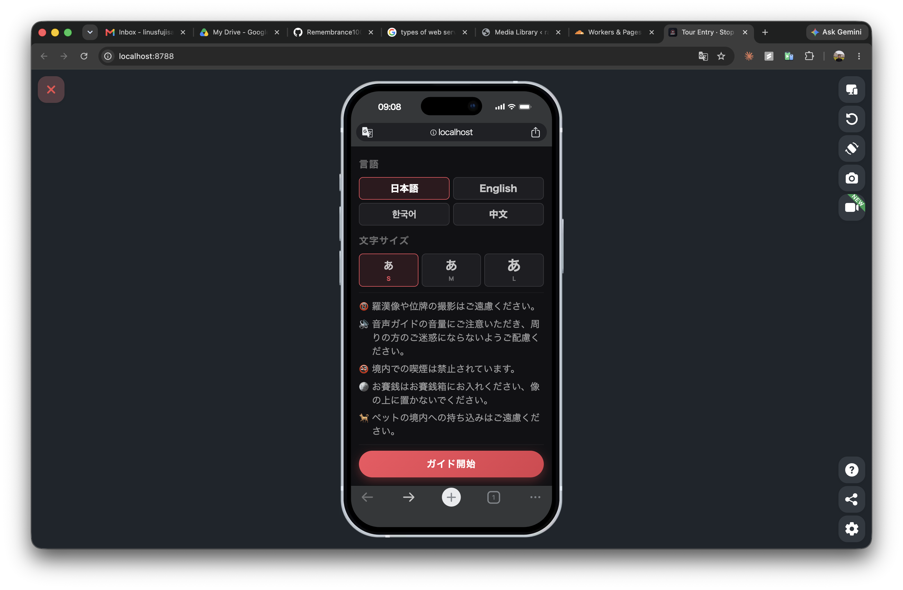
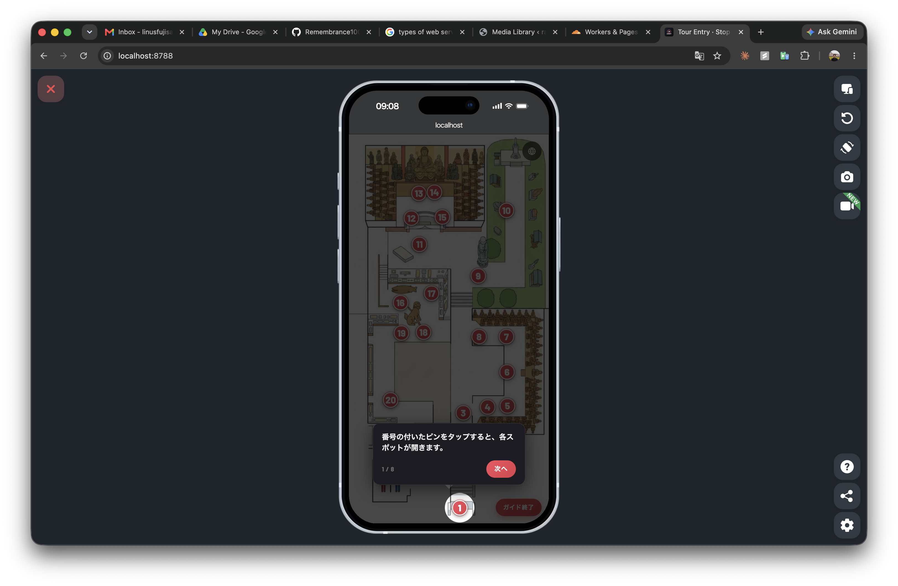
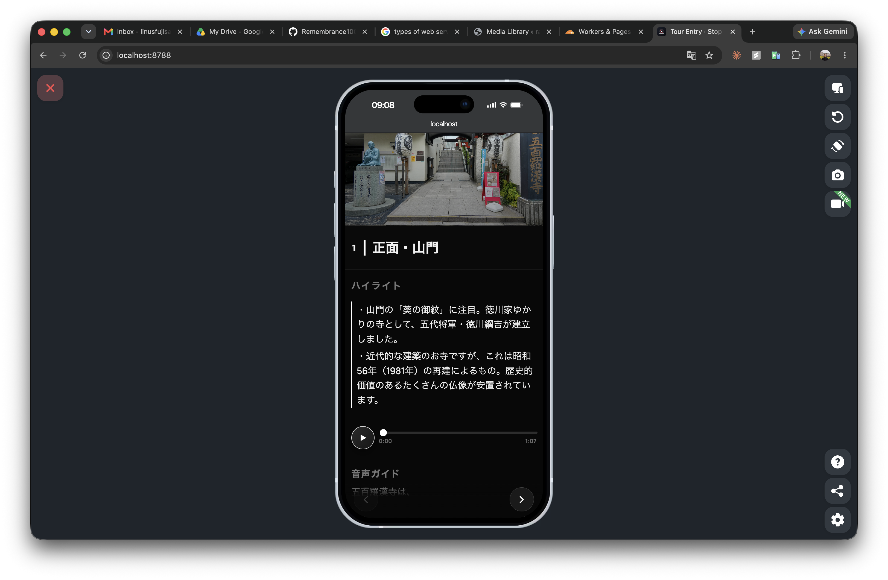
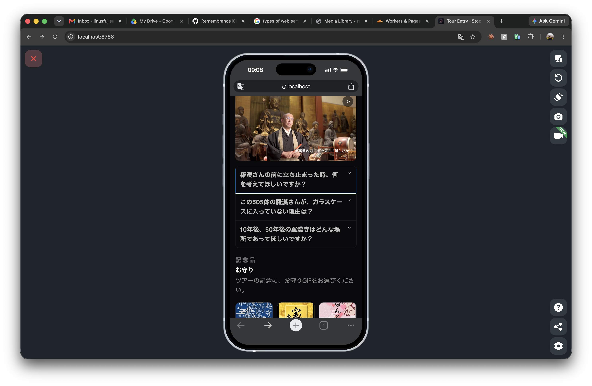
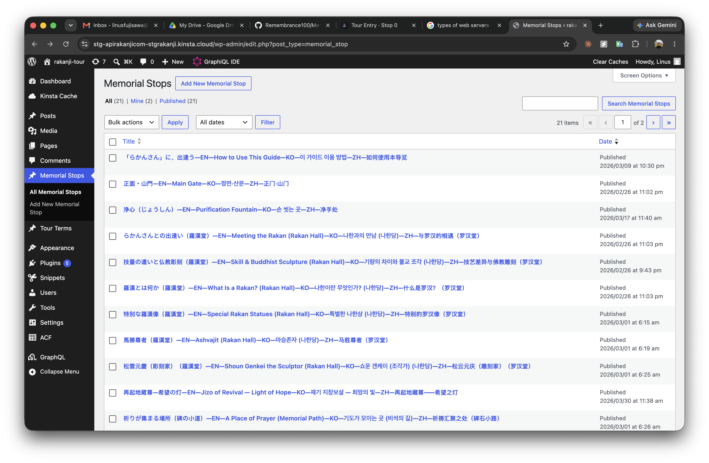
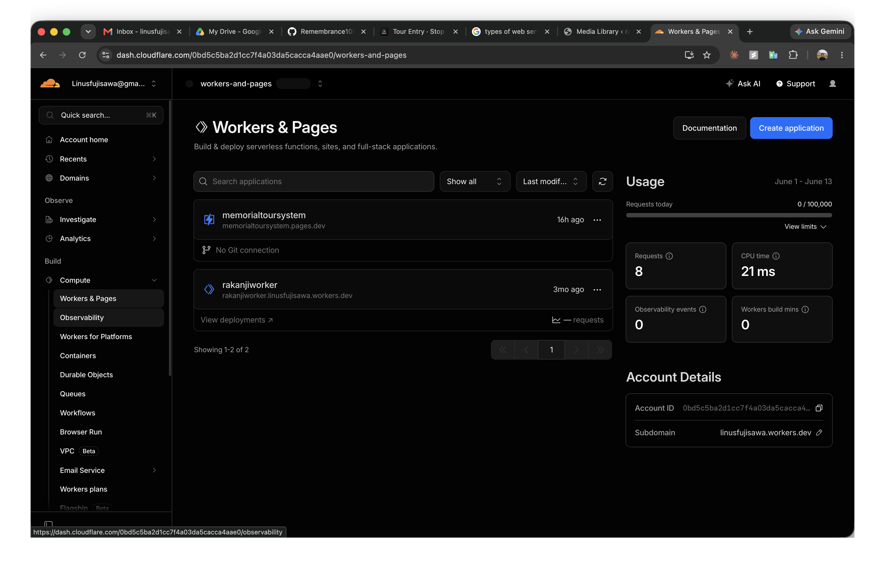
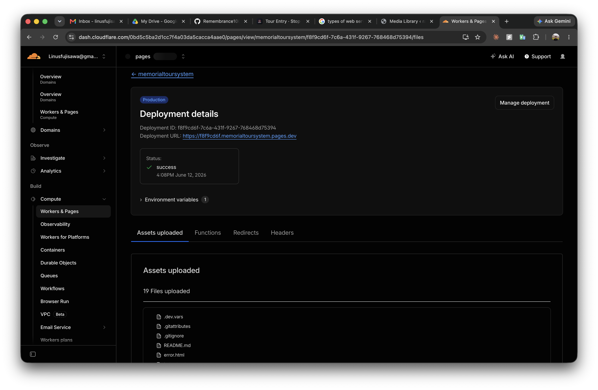

# Memorial Tour Guide · SmartSenior

A production-ready, multilingual audio tour web app built for real-world deployment at Japanese memorial and temple grounds. Visitors purchase access through Stripe, then receive a time-limited token unlocking an interactive guided experience — all without a backend server or native app install.

**Live on Cloudflare Pages · PWA · Stripe Payments · 4 Languages**

---

### Tour Experience

| Language & Settings | Interactive Map | Stop Detail | Post-Tour Gift |
|---|---|---|---|
|  |  |  |  |

### WordPress CMS · Temple Staff Dashboard

| Memorial Stop Management | Media Library |
|---|---|
|  |  |

### Cloudflare Pages · Production Deployment

| Workers & Pages Dashboard | Deployment Details |
|---|---|
|  |  |

---

## What I Built

A full end-to-end digital tour product — from payment to guided experience — deployed on Cloudflare's global edge network. The system handles ticketing, access control, multilingual content, interactive maps, audio playback, and a post-tour gift, all in a vanilla JS PWA with no framework dependencies.

This is a **collaborative, multi-user system**. Temple staff manage their own content — tour stop text, images, and titles — through a WordPress CMS without touching any code. Cloudflare sits in front as the CDN and hosting layer, serving the experience globally at edge speed. The separation means non-technical stakeholders have full ownership of their content while the delivery infrastructure stays fast and reliable.

---

## Key Technical Decisions

**Serverless edge architecture** — API functions run on Cloudflare's edge network, eliminating the need for a managed server. Payments and token signing happen at the edge, globally, with no cold-start latency.

**Stripe + HMAC token access control** — after payment, the server issues a cryptographically signed 24-hour access token (HMAC-SHA256) stored in localStorage. Subsequent visits are validated client-side without hitting the API again.

**Framework-free** — the entire UI is built in vanilla JS and CSS. No React, no build pipeline, no bundler. This keeps the app lightweight, fast to load on mobile networks, and simple to deploy anywhere.

**PWA-first** — the app is installable on iOS and Android via Web App Manifest, runs in standalone mode with no browser chrome, and is designed for portrait mobile use in the field.

**Multilingual without a CMS** — supports Japanese, English, Korean, and Traditional Chinese with adjustable font sizes (S/M/L), built specifically for an older international visitor demographic.

---

## Features

- Interactive pinch/pan map with per-stop markers
- Per-stop audio guide with scrubber, transcript, and image gallery
- Tappable glossary terms with modal detail views
- Stripe Checkout — one-time purchase, ¥1,500, 24-hour access
- Post-tour omamori (good luck charm) gift screen with downloadable animations
- Language and font size settings persisted across sessions
- Coach mark onboarding for first-time users

---

## Tech Stack

| | |
|---|---|
| Frontend | Vanilla JS, HTML5, CSS3 |
| CMS | WordPress (temple staff content management) |
| CDN / Hosting | Cloudflare Pages |
| Serverless API | Cloudflare Pages Functions |
| Payments | Stripe Checkout |
| Auth | HMAC-SHA256 signed tokens via Web Crypto API |
| PWA | Web App Manifest + Service Worker |

---

## Built for SmartSenior

Developed as part of SmartSenior — a platform bringing digital experiences to Japanese cultural and memorial sites.
