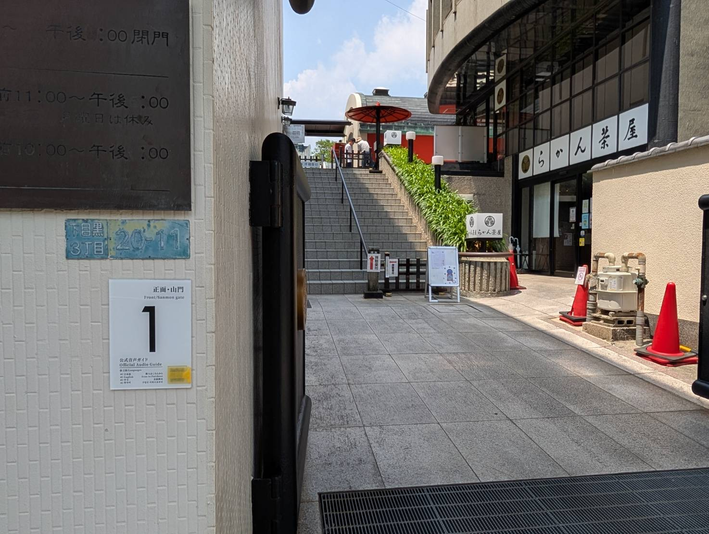
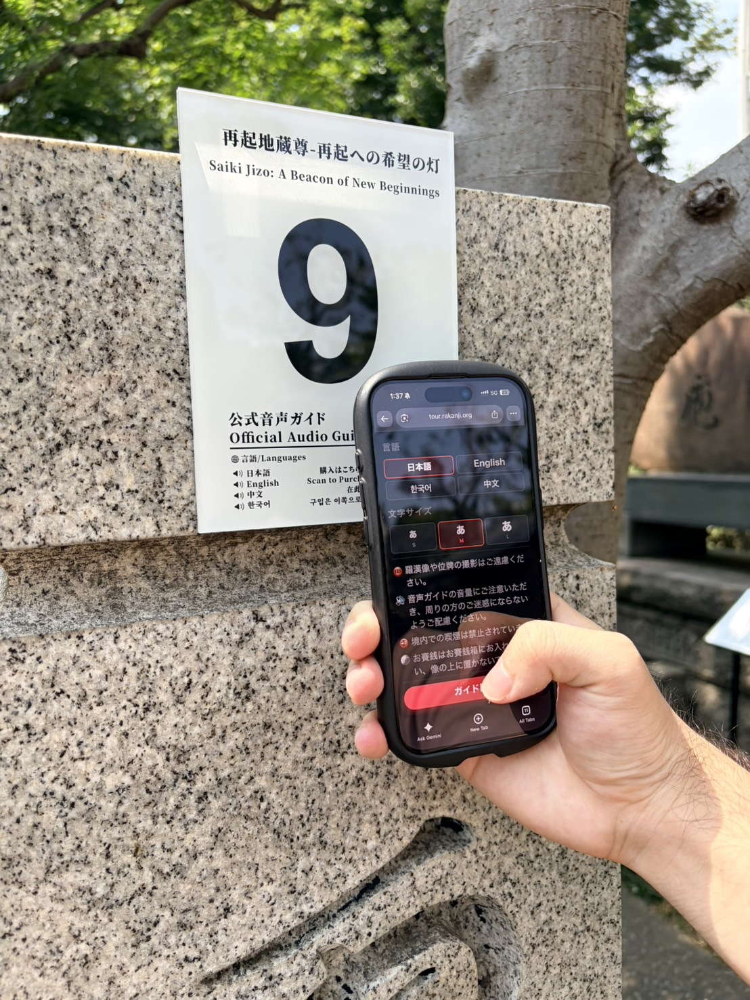
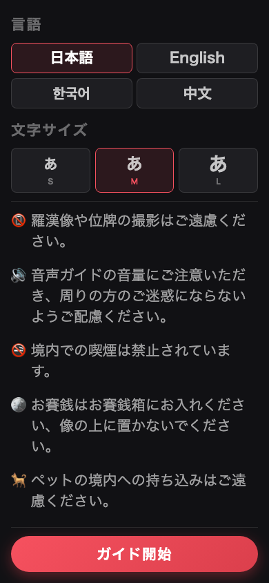
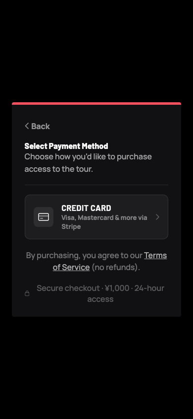
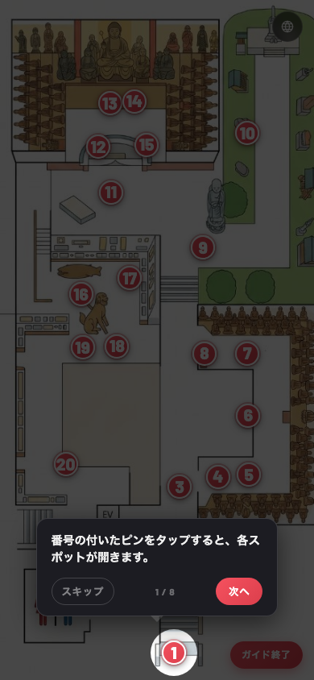

# Gohyaku Rakanji — Interactive Audio Tour Guide

**Live: [tour.rakanji.org](https://tour.rakanji.org/)** (mobile — intended for on-site visitors)

A paid, multi-language interactive audio tour guide for [天恩山五百羅漢寺 (Tenonzan Gohyaku Rakanji)](https://rakan.or.jp), a Buddhist temple in Meguro, Tokyo established in 1695 and known as the birthplace of the "Rakan" (Arhat) belief. Visitors scan in on-site, pay once for 24-hour access, and walk the grounds following an interactive map with narrated audio at each stop.



Live in use at Stop 9 on the temple grounds:



## Screenshots

| Entry & rules                               | Payment                                              | Interactive map                            |
| ------------------------------------------- | ----------------------------------------------------- | ------------------------------------------ |
|  |  |  |

## Highlights

- **Interactive stop map** — tap-to-navigate pins over an illustrated floor plan, with per-stop detail views and inline audio playback
- **Headless CMS integration** — content (stop titles, descriptions, images, audio) is authored by temple staff in a WordPress + ACF backend and pulled into the frontend through a custom REST API, so the app never hardcodes content
- **Multi-language i18n** — full UI and tour content in Japanese, English, Korean, and Chinese
- **Signed, stateless auth** — a custom HMAC-SHA256 token scheme gates 24-hour access after payment, verified without any server-side session store
- **Serverless throughout** — static frontend and API routes both deployed as Cloudflare Pages Functions, no origin server to manage

## Stack

- Frontend: HTML/CSS/vanilla JS, deployed as a Cloudflare Pages site
- Backend: Cloudflare Pages Functions (serverless)
- Content management: WordPress + ACF (Kinsta-hosted) — custom post types for tour stops and terms, exposed via a custom REST route
- Payments: Stripe Checkout API
- Auth: custom HMAC-SHA256 signed session tokens (`functions/_lib/access-token.js`)

## Architecture

```
WordPress (Kinsta) + ACF                 Cloudflare Pages
  ┌──────────────────────┐   REST API    ┌────────────────────────┐
  │ Memorial Stops (CPT)  │ ────────────▶ │ tour.html / script.js  │
  │ Tour Terms (CPT)      │ /memorial/v1/ │ interactive map + audio│
  └──────────────────────┘   tour         └────────────────────────┘
```

```
functions/
  _lib/
    access-token.js      # Issues the 24h HMAC-signed access token
  api/
    create-checkout.js   # Starts a Stripe Checkout session
    verify-session.js    # Verifies a Stripe session, issues the access token
```

## My role

I was the software engineer for this project. The WordPress/ACF content backend was set up separately for temple staff to manage stop content; I built the entire visitor-facing side: the interactive map and multi-language UI, the API integration layer consuming the WordPress REST route, and the payment/auth infrastructure connecting it all together.
