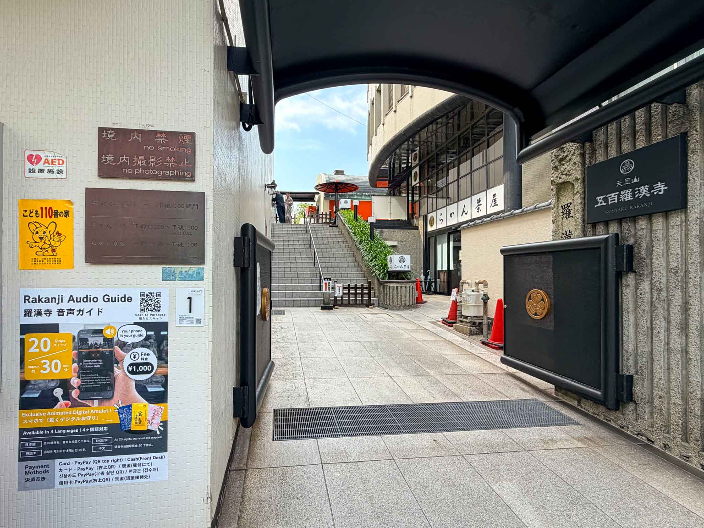
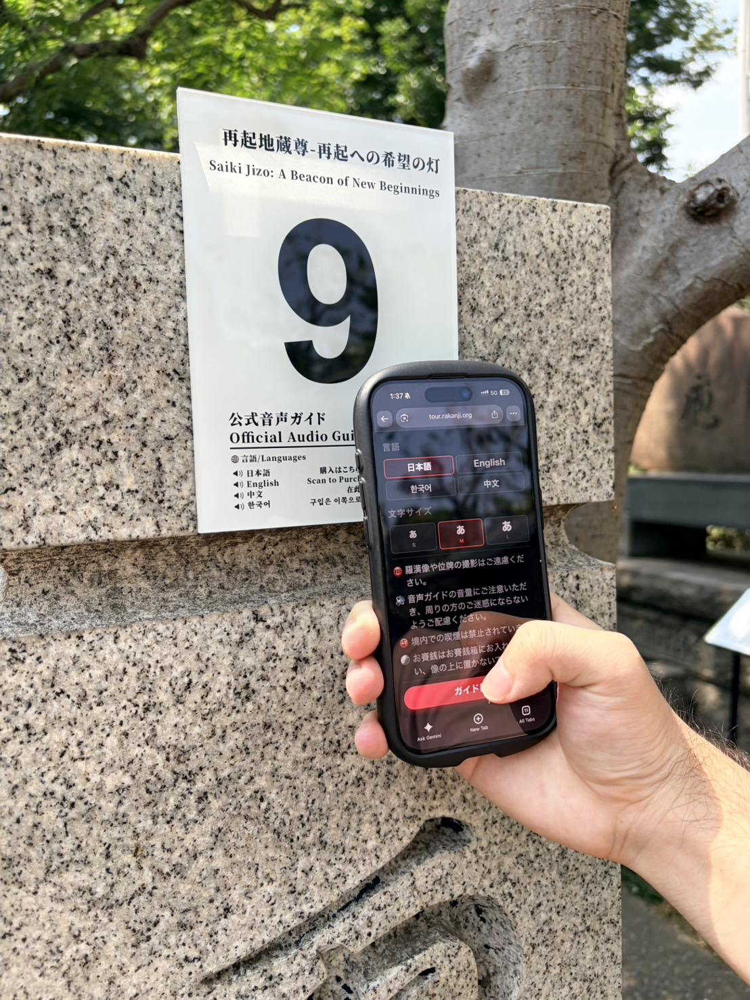
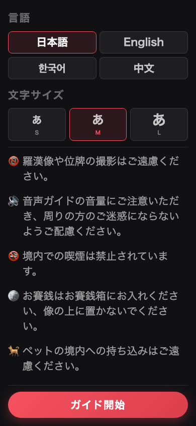
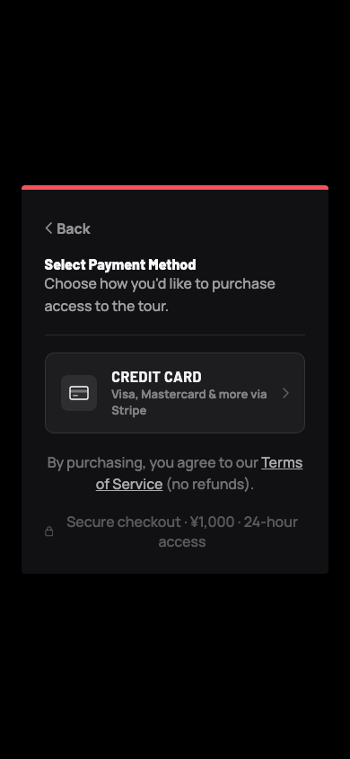
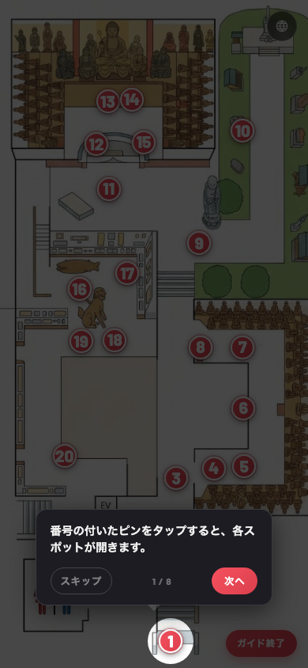

# Gohyaku Rakanji: Interactive Audio Tour Guide

**Live:** [tour.rakanji.org](https://tour.rakanji.org/) (mobile-first, built for on-site visitors)

A paid, multi-language interactive audio tour guide for [天恩山五百羅漢寺 (Tenonzan Gohyaku Rakanji)](https://rakan.or.jp), a Buddhist temple in Meguro, Tokyo established in 1695 and known as the birthplace of the "Rakan" (Arhat) belief. Visitors scan in on-site, pay once for 24-hour access, and walk the grounds following an interactive map with narrated audio at each stop.

| Temple entrance                                                         | Live in use at Stop 9                                                    |
| ----------------------------------------------------------------------- | ------------------------------------------------------------------------ |
|  |  |

## Screenshots

| Entry & rules                               | Payment                                              | Interactive map                            |
| ------------------------------------------- | ---------------------------------------------------- | ------------------------------------------ |
|  |  |  |

## Highlights

- **Interactive stop map**: tap-to-navigate pins over an illustrated floor plan, with per-stop detail views and inline audio playback
- **Headless CMS integration**: content (stop titles, descriptions, images, audio) is authored by temple staff in a WordPress + ACF backend and pulled into the frontend through a custom REST API, so the app never hardcodes content
- **Multi-language i18n**: full UI and tour content in Japanese, English, Korean, and Chinese
- **Signed, stateless auth**: a custom HMAC-SHA256 token scheme gates 24-hour access after payment, verified without any server-side session store
- **Free preview**: stops 1–3 open for anyone, before any payment, and going past them leads to the paywall
- **Two payment providers**: Stripe Checkout for cards, PayPay for Japan's dominant QR wallet, both issuing the same access token
- **Built for weak reception**: the tour runs on temple grounds where signal is poor, so image payload was cut 154MB → 73MB and the next stop preloads while the visitor is listening
- **Serverless throughout**: static frontend and API routes both deployed as Cloudflare Pages Functions, no origin server to manage

## Stack

- Frontend: HTML/CSS/vanilla JS, deployed as a Cloudflare Pages site
- Backend: Cloudflare Pages Functions (serverless)
- Content management: WordPress + ACF (Kinsta-hosted), custom post types for tour stops and terms, exposed via a custom REST route
- Payments: Stripe Checkout API, and PayPay OPA via a relay on the WordPress host (see below)
- Email: Cloudflare Email Routing, from a standalone Worker (`workers/contact/`)
- Auth: custom HMAC-SHA256 signed session tokens (`functions/_lib/access-token.js`)

## Architecture

```
WordPress (Kinsta) + ACF                 Cloudflare Pages
  ┌──────────────────────┐   REST API    ┌────────────────────────┐
  │ Memorial Stops (CPT)  │ ────────────▶ │ tour.html / script.js  │
  │ Tour Terms (CPT)      │ /memorial/v1/ │ interactive map + audio│
  └──────────────────────┘   tour         └────────────────────────┘
```

```
functions/                       # Cloudflare Pages Functions (serverless API)
  _lib/
    access-token.js              # Issues the 24h HMAC-signed access token
    paypay-relay.js              # Signed calls to the PayPay relay
    cash-code.js                 # Derives the daily cash code (HMAC of the JST date)
  api/
    create-checkout.js           # Starts a Stripe Checkout session
    verify-session.js            # Verifies a Stripe session, issues the token
    create-paypay-payment.js     # Starts a PayPay payment via the relay
    verify-paypay-payment.js     # Verifies a PayPay payment, issues the token
    verify-cash-code.js          # Checks a front-desk code, issues the token
    staff-cash-code.js           # Returns today's code to the front desk
  img/
    [[path]].js                  # Same-origin proxy for tour images
workers/                         # Standalone Workers — each deploys separately
  contact/                       # Contact form → email, Email Routing binding
  daily-code/                    # Emails the front desk the day's cash code
  watchdog/                      # Probes the live site, emails when it breaks
  _shared/mime.js                # Email message helpers shared by the Workers
wordpress/                       # Code that runs on the WordPress backend
  memorial-tour-endpoint.php     # The /memorial/v1/tour REST endpoint
  paypay-relay.php               # PayPay relay (fixed, whitelisted egress IP)
```

### Payments: Stripe and PayPay

Card payments go straight from a Pages Function to Stripe Checkout. PayPay could
not work the same way, and the reason is the more interesting part of this
codebase.

PayPay restricts API access to IP addresses registered during merchant
application. Cloudflare Pages Functions have no fixed egress IP — requests leave
from many rotating Cloudflare addresses — so every call was rejected with
`Unauthorized request (08100016)`. That error reads like a credentials problem
and is not one: PayPay's own official Node SDK was rejected with the same key
from a local machine, which ruled out the signing implementation.

The registered IP belongs to the WordPress host, so PayPay calls are made from
there instead:

```
browser → tour.rakanji.org/api/*  (Pages Functions)
        → rakanji.org relay        (fixed, whitelisted IP)
        → apigw.paypay.ne.jp
```

The relay holds the PayPay credentials and fixes the amount itself, so a caller
that got past its authentication still cannot choose its own price. Requests to
it are HMAC-signed over `{timestamp}\n{body}` inside a 300-second window.
`TOKEN_SECRET` never leaves Cloudflare, so a compromised relay cannot mint tour
access on its own. Full write-up: [`wordpress/PAYPAY-RELAY.md`](wordpress/PAYPAY-RELAY.md).

### Free preview

Visitors can try the app before paying. Settings → entry screen → `tour.html`
works without an access token, in a preview mode: stops 1–3 open normally, and
anything past them — a map pin, the stop picker, the Next arrow on stop 3, End
Tour — opens a paywall that sends the visitor to `privacy.html` and on to
payment. Locked pins and picker rows are greyed out so it's clear where the
preview ends. Anyone holding a valid token (paid, or a cash code) gets the whole
tour as before.

The limit is `PREVIEW_STOP_LIMIT` in `assets/js/script.js`. It's enforced in the
browser only, like the access gate it replaced, and the tour JSON is a public
WordPress endpoint anyway — so it's a nudge toward paying, not a lock.

### Cash payments

A third option next to Card and PayPay: `cash.html` tells the visitor to pay at
the front desk, then takes a 6-digit code. The code isn't stored anywhere — both
`functions/api/verify-cash-code.js` and `functions/api/staff-cash-code.js` derive
it the same way, as `HMAC(CASH_CODE_SECRET, "cash-code|" + today's date in JST)`,
so it rotates at JST midnight with nothing to update by hand. `staff-code.html`
is how the front desk reads today's value — it's gated by `STAFF_ACCESS_KEY`, a
passphrase shared with them out of band, kept separate from `CASH_CODE_SECRET` so
rotating one never touches the other. Neither var is set yet; both fall back to
`TOKEN_SECRET`/`STRIPE_SECRET_KEY` for the code secret, but `STAFF_ACCESS_KEY` has
no fallback and must be set before `staff-code.html` will work.

There's no rate limiting on `verify-cash-code` — same as the Stripe/PayPay verify
endpoints — so a 6-digit code is brute-forceable in principle. Low risk today
(1-in-a-million odds per guess, temple-scale traffic), but worth a KV-backed
throttle if this ever gets attention from farther afield.

### Image sizing

The tour endpoint used to return whatever WordPress stored — in practice 2560px
`-scaled.jpg` originals — for images phones display at 360–760px. Measured
across the live tour: 195 images, 154MB, averaging 809KB each. WordPress had
already generated smaller variants at upload time, so the endpoint now asks for
those and the frontend no longer strips the size suffix back off: **154MB → 73MB**
with no re-uploading and no visible quality change on a phone. That matters
because visitors use this on temple grounds with weak reception, where a 946KB
hero image is a 7–8 second wait and its 164KB variant is about one.

### Contact form email

`contact.html` POSTs to `/api/contact`, which is served by a standalone Worker
(`workers/contact/`) rather than a Pages Function — the free Email Routing
`send_email` binding is Workers-only, while the equivalent Pages-compatible REST
API requires the paid Workers plan. A route on `tour.rakanji.org/api/contact`
keeps it same-origin with the site.

Deploy it separately from the Pages site:

```
cd workers/contact && npx wrangler deploy
```

Setup it depends on (Cloudflare dashboard → Email Routing, zone `rakanji.org`):
`contact@rakanji.org` as a custom address, and `500@rakan.or.jp` added _and
verified_ as a destination address.
